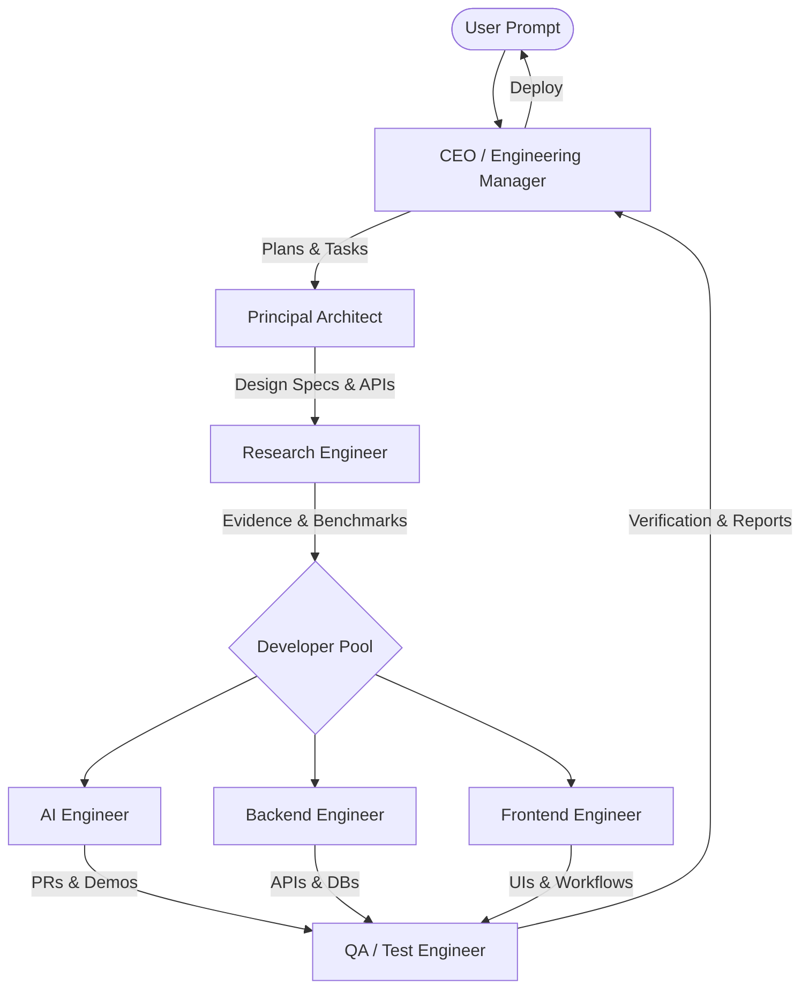

# Hackathon Team Playbook: Multi-Agent Collaboration System

Welcome to the **Autonomous Engineering Workspace**. This repository is configured with a complete multi-agent design framework, a comprehensive engineering skills library, and standardized processes optimized for rapid, high-quality development in hackathons and tight-deadline environments.

This guide details how to coordinate the specialized agents and run development workflows **in parallel** for maximum velocity.

---

## 🏗️ System Overview & Agent Interaction

Our organization separates concerns across seven specialized agent roles, governed by the [Shared Engineering Rules](file:///.agents/shared_rules.md).

### 👥 Agent Roles
*   **[CEO (CTO / Engineering Manager)](file:///.agents/CEO.md)**: Coordinates the team, owns planning, task decomposition, prioritization, and quality gates. **Never writes production code directly.**
*   **[Architect (Principal Architect)](file:///.agents/architect.md)**: Defines system architecture, folder structures, API contracts, databases, caching, and state strategies.
*   **[Research (Research Engineer)](file:///.agents/research.md)**: Investigates APIs, compares libraries, audits licenses, verifies breaking changes, and eliminates technical unknowns.
*   **[AI (AI Engineer)](file:///.agents/ai.md)**: Builds LLM integrations, RAG pipelines, prompt templates, tool definitions, and agent workflows.
*   **[Backend (Backend Engineer)](file:///.agents/backend.md)**: Sets up APIs, databases, caches, queues, background workers, and deployment containers.
*   **[Frontend (Frontend Engineer)](file:///.agents/frontend.md)**: Implements responsive, accessible, and performant user interfaces, state management, and routing.
*   **[QA (Quality Assurance)](file:///.agents/qa.md)**: Writes unit, integration, and E2E tests (using Playwright), performs load/penetration testing, and acts as the final gatekeeper.

---

## 📚 The Skills Library Matrix

Our skills library under [`skills/`](file:///Users/zaif/Desktop/NEW/skills/) serves as the source of truth guidelines for each domain. Agents load these skills dynamically depending on their active tasks.

| Category | Skills Directory | Key Topics Covered | Primary Agent Owner |
| :--- | :--- | :--- | :--- |
| **AI** | [`skills/ai/`](file:///Users/zaif/Desktop/NEW/skills/ai/) | Prompt Engineering, Agent Architecture, Workflows, RAG, Evaluation Pipelines, LLMOps | **AI Engineer** |
| **Backend** | [`skills/backend/`](file:///Users/zaif/Desktop/NEW/skills/backend/) | FastAPI, PostgreSQL/Redis, Websockets, Background Jobs, Docker, Microservices | **Backend Engineer** |
| **Frontend** | [`skills/frontend/`](file:///Users/zaif/Desktop/NEW/skills/frontend/) | HTML/CSS/JS, React/Next.js, Tailwind/Shadcn, State Management, Rendering & Accessibility | **Frontend Engineer** |
| **QA** | [`skills/qa/`](file:///Users/zaif/Desktop/NEW/skills/qa/) | Unit & Integration Testing, Playwright E2E, Load Testing, Bug Triage, Code Review | **QA Engineer** |

---

## ⚡ Parallel Execution Workflow (Hackathon Blueprint)

To build software at extreme speeds during the hackathon, agents should work **in parallel** rather than sequentially. Follow this 5-step pipelined workflow:

### Phase 1: Planning & Architecture (CEO + Architect + Research)
1. **CEO** breaks down the requirements and creates an `implementation_plan.md` in the artifacts folder.
2. **Architect** designs the schemas and drafts the API contract (e.g. OpenAPI spec or TypeScript types).
3. **Research** validates external dependencies (e.g., checking if the selected API has rate limits or deprecated endpoints).
4. *Checkpoint*: The team signs off on the API contract.

### Phase 2: Parallel Setup & Worktrees
To work concurrently without blocking each other:
*   Use isolated workspaces or Git branches for different modules:
    *   `feature/ai-agents` (AI Engineer)
    *   `feature/backend-api` (Backend Engineer)
    *   `feature/frontend-ui` (Frontend Engineer)
*   Agents mock their external dependencies immediately so they can run their components locally:
    *   **Frontend** uses the Architect's mock JSON or API contracts to build UI pages before the backend API is live.
    *   **Backend** implements controllers with mock data or DB queries to unblock the Frontend integration.
    *   **AI** designs prompts and processes responses locally using mocked model outputs before embedding retrieval is active.

### Phase 3: Synchronized Development (AI + Backend + Frontend)
*   **Backend** builds the database models and core API endpoints.
*   **AI** integrates LLM APIs, vector stores, and prompt templates, exposing them as backend modules or microservices.
*   **Frontend** connects the components to the API layer, implementing UI flows, loading states, and error boundary protections.

### Phase 4: Parallel QA & Testing (QA)
*   As soon as a component is ready, **QA** writes integration and unit tests for it.
*   While Backend/Frontend are finalizing code, **QA** runs Playwright browser automation tests against mock/staging servers to catch UI and interaction regressions early.

### Phase 5: Integration & Verification
*   Merge all branches into main.
*   Run the E2E verification suite.
*   CEO approves the final release based on the QA verification reports.

---

## 🚀 How to Load and Execute Agents

Each agent has a system profile defined under [`.agents/`](file:///.agents/). To run a task using these agents:

1.  **Select the profile**: Load the agent instructions from the corresponding `.md` file (e.g., [`.agents/ai.md`](file:///.agents/ai.md)).
2.  **Refer to the Skills**: Load the relevant skills from [`skills/`](file:///Users/zaif/Desktop/NEW/skills/) to guide the implementation.
3.  **Use templates**: Always follow the templates in [`templates/`](file:///Users/zaif/Desktop/NEW/templates/) for bug reporting or feature specs.
4.  **Enforce rules**: Ensure code follows the [Shared Engineering Rules](file:///.agents/shared_rules.md) and the [Engineering Constitution](file:///Users/zaif/Desktop/NEW/knowledge/engineering_constitution.md).

Let's win this hackathon! 🏆
