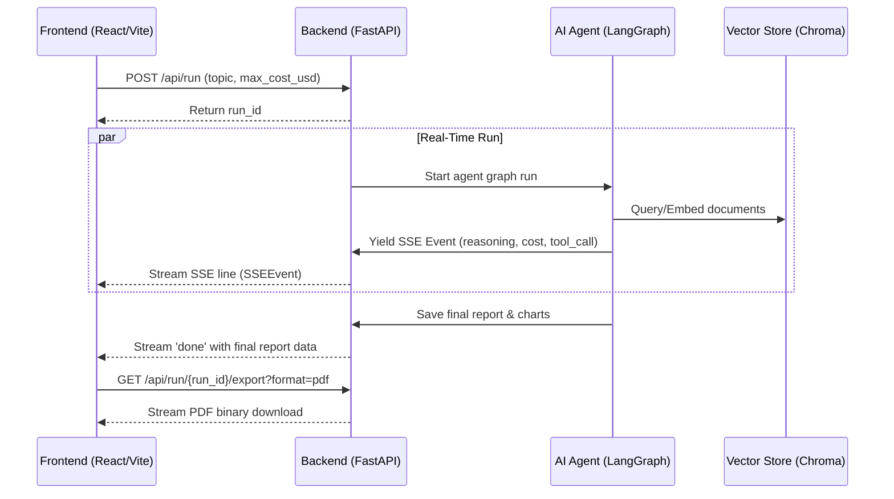

# Task 03: Autonomous Multi-Tool AI Research Agent - Implementation Plan

This plan details the design, architecture, and step-by-step parallel tasks for implementing Task 03 (Autonomous Multi-Tool AI Research Agent). It is designed to be executed concurrently by Backend, AI, Frontend, and QA subagents.

---

## 🏗️ System Architecture & Parallel Workflows

We maximize velocity by splitting the development of the autonomous agent system into four parallel work packages. To prevent blocking, we define a strict contract between the components upfront, including API endpoints, JSON schemas, SSE formats, and mock data.



---

## 🔌 API & Data Contracts

### 1. `POST /api/v1/agent/run` (Initiate Research Run)
- **Request Body**:
  ```json
  {
    "topic": "wearable technology competitive landscape top 5 competitors",
    "max_cost_usd": 1.0
  }
  ```
- **Response**:
  ```json
  {
    "success": true,
    "run_id": "run-abc-123",
    "message": "Research run started successfully."
  }
  ```

### 2. `GET /api/v1/agent/stream/{run_id}` (SSE Log Stream)
Streams real-time logs using the standard `SSEEvent` schema:
```python
class SSEEvent(BaseModel):
    type: Literal["reasoning", "tool_call", "tool_result", "cost", "report", "error", "done"]
    data: dict[str, Any]
    run_id: str
```
- **reasoning**: `{"text": "Searching for competitor information..."}`
- **tool_call**: `{"tool": "web_search", "args": {"query": "wearable tech competitors"}}`
- **tool_result**: `{"tool": "web_search", "success": true, "output": "..."}`
- **cost**: `{"input_tokens": 120, "output_tokens": 85, "total_tokens": 205, "total_usd": 0.00025, "cumulative_usd": 0.0012}`
- **report**: `{"markdown": "# Final Report\n...", "charts": [{"name": "market_share.png", "base64": "..."}]}`
- **error**: `{"message": "Tool execution failed..."}`
- **done**: `{"report_id": "report-xyz"}`

### 3. `GET /api/v1/agent/report/{run_id}/pdf` (Export PDF Report)
- Returns binary file download of the formatted PDF report.

### 4. `GET /api/v1/agent/report/{run_id}/markdown` (Export Markdown Report)
- Returns markdown text file download.

---

## 👥 Parallel Agent Tasks

### 🧠 Task 1: AI Engineer (Vector Memory Store + Agent Logic)
- **Primary Domain**: `task03-agent/backend/app/agent/`
- **Goal**: Implement the fourth tool (`vector_memory`) and the core LangGraph research agent.
- **Key Deliverables**:
  1. `task03-agent/backend/app/agent/tools/vector_memory.py`:
     - Chromadb-backed or in-memory vector storage tool.
     - Supports `add_facts(facts: list[str])` and `query_facts(query: str, n_results: int)`.
  2. `task03-agent/backend/app/agent/graph.py`:
     - Compiles the LangGraph workflow utilizing `web_search`, `pdf_reader`, `code_executor`, and `vector_memory`.
     - Tracks iterations and cost.
     - Has retry and exception handling on tool nodes to ensure resilience (tool failure doesn't crash the run).
     - Yields streaming updates (reasoning, tool calls, costs) using a callback generator.

### 💻 Task 2: Backend Engineer (FastAPI Server + SSE Router + Report Exporter)
- **Primary Domain**: `task03-agent/backend/app/api/`
- **Goal**: Implement APIs to trigger runs, stream agent progress, and export reports in PDF/Markdown.
- **Key Deliverables**:
  1. `task03-agent/backend/app/api/router.py`:
     - Router exposing `/api/run`, `/api/run/{run_id}/stream`, and `/api/run/{run_id}/export`.
     - Integrates with the AI agent graph using an async generator for SSE streaming.
  2. `task03-agent/backend/app/utils/pdf_generator.py`:
     - Generates formatted PDFs from Markdown using `reportlab`.
     - Embeds matplotlib-generated charts if present in the report data.
  3. `task03-agent/backend/app/main.py`:
     - Application entry point. Configures CORS and handles routing.

### 🎨 Task 3: Frontend Engineer (React/Vite UI + SSE Logger + Markdown Chart Renderer)
- **Primary Domain**: `task03-agent/frontend/`
- **Goal**: Create a stunning React dashboard to run research, view streaming progress, and download reports.
- **Key Deliverables**:
  1. Project Setup: Initialize a clean Vite + React + TypeScript + TailwindCSS app in `task03-agent/frontend/`.
  2. Dashboard UI:
     - Beautiful dark-themed dashboard with Outfit or Inter font.
     - **Control Panel**: Topic input, budget slider, trigger button.
     - **Live Monitor**: Side-by-side view of (a) Live terminal showing reasoning logs, tool calls (with icons/collapsible outputs) and (b) Real-time token usage progress meters/cost tracking.
     - **Results Pane**: Real-time rendering of markdown report and dynamically rendered comparison charts.
     - **Export Panel**: Markdown and PDF download buttons.

### 🧪 Task 4: QA Engineer (API, Unit, and Playwright Tests)
- **Primary Domain**: `task03-agent/backend/tests/` and `task03-agent/frontend/tests/`
- **Goal**: Write tests to fully cover backend endpoints, AI tools/graphs, and frontend flows.
- **Key Deliverables**:
  1. Backend API tests in `task03-agent/backend/tests/test_api.py`.
  2. AI agent unit tests in `task03-agent/backend/tests/test_agent.py` (mocking the LLM calls).
  3. Playwright E2E tests in `task03-agent/frontend/tests/e2e.spec.ts` (verifying frontend connects, triggers runs, displays stream, exports files).

---

## 🧪 Verification Plan

### Automated Tests
- Backend & Agent: `pytest task03-agent/backend/tests/ -v`
- Frontend UI: `npm run test` or `npx playwright test`

### Manual Verification
1. Run backend server: `uvicorn app.main:app --reload`
2. Run frontend dev server: `npm run dev`
3. Trigger a competitive analysis on "top 5 wearable tech competitors" and verify SSE log stream, live cost updates, chart generation, markdown display, and PDF export functionality.
